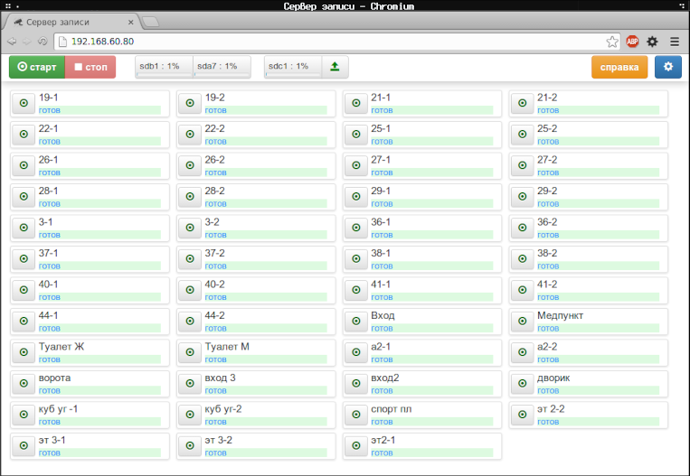
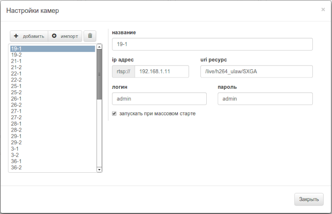

# Parallel recording RTSP streams from CCTV cameras to multiple storages
> ⚠️ **DEPRECATED** ⚠️ 
the code is extremely **obsolete!** (python 2.6) 
the only purpose of this repo is to **demonstrate** the task solution

## Task
Our team got a task to create a tool for simultaneously recording multiple 
RTSP streams from CCTV cameras to several storages on the server.

The removable storage must be able to detach from the server at the end of 
recording and must contain playable video files (MPEG encoded).

All video content must be split into half-hour parts and put into 
`date/camera-name/time` directories.

The streaming database and the recording process must be able to manage 
by unqualified staff via a web interface.

## Solution
System is written in Python 2.6 and contains:

- Flask server: json-rpc over websocket API and web interface (bootstrap)
- channels controller (parallel stream management - ffmpeg processes)
- storages observing (attach/detach, capacity monitoring)
- sqlite database

## Screenshots

### Main page

### Setting window

